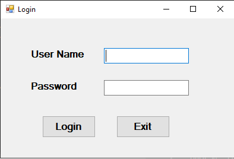
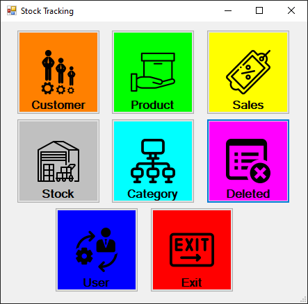
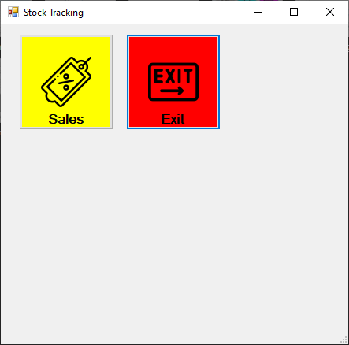
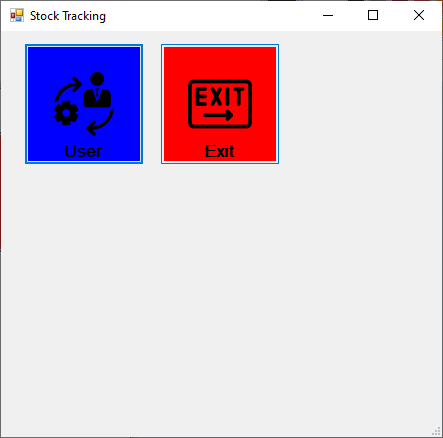
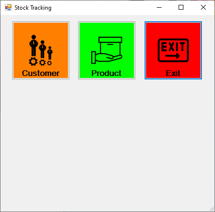
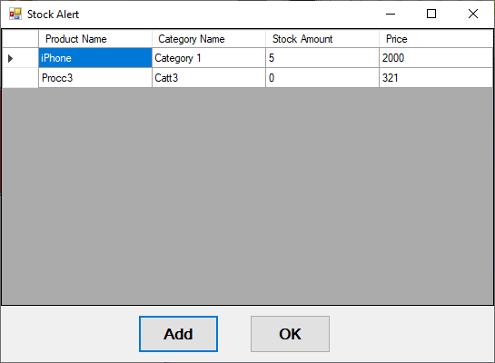
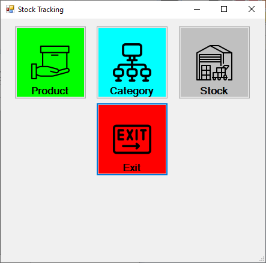
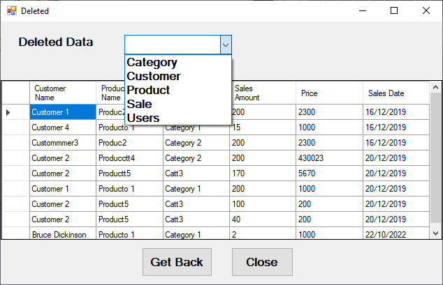

# Stock Tracking

Stock Tracking es una aplicación de escritorio realizada en C#, usando el patrón de diseño Fachada (Facade), arquitectura N-Tiers y SQL Server como base de datos para la persistencia de los datos.

Tiene implementado 5 roles (administrador, recursos humanos, reponedor, comercial y vendedor). De esta forma, al hacer login, se cargara la pantalla principal adaptada a las operaciones que cada rol puede realizar, tal y como se muestran en las siguientes imagenes:

>Pantalla de Login

>Pantalla del Administrador

>Pantalla del Vendedor

>Pantalla de Recursos Humanos

>Pantalla del Comercial

En el caso del rol reponedor, tendremos una variación. En caso de ser necesario (numero de producto en stocl menor de 10), saldrá antes del menú un formulario de alerta.

>Alerta de Stock

>Pantalla del Reponedor

A continuación, se enumeran las operacioens que podemos realizar

## Categorías

Las categorías agrupan a los productos en función del criterio de agrupación que deseemos. La categoría deberá estar creada previamente a la adicción de un producto. 

Del mismo modo, tendremos una vista que nos listará todas las categorías que tengamos en el sistema. Desde dicha vista podremos añadir nuevas categoría, editar una previamente existente o eliminarla.

## Productos

Los productos son aquellos items que podemos vender en nuestro sistema.

Tendremos una vista que nos listará todas los que existen en el sistema. Desde dicha vista podremos añadir, eliminar o editar un producto.

Cada producto nuevo que creemos tendra inicialmente un stock de 0 unidades. Deberemos hacer uso de la siguiente pantalla para añadir stock

## Añadir Stock

A través del correspondiente botón (o bien desde el formulario de alerta de stock), podemos acceder al siguiente formulario para modificar el stock de los productos.

## Ventas

El sistema nos mostrará un listado con todas las ventas que tenemos en el sistema. Nuevamente desde dicha vista podremos añadir una nueva venta así como editar o borrar una que existiera previemente.

Al hacer la venta se tendrá que elegir el producto y al cliente al que se le vende, indicando la cantidad de unidades que se le vende. Esta implementado la validación para no vender más unidades de las que tenemos en stock

## Clientes

El sistema tiene un formulario que muestra un listado de todos los clientes en el sistemas, con la posibilidad de busqueda integrada. Desde ese formulario podemos añadir, borrar o editar clientes.

El formulario de alta de nuevos clientes solo pedira el nombre del mismo

## Recuperación de datos

Todos los borrados del sistema son del tipo soft delete. A traves de este formulario podemos seleccionar la categoria que nos interese y recueprar los datos que seleccionemos

